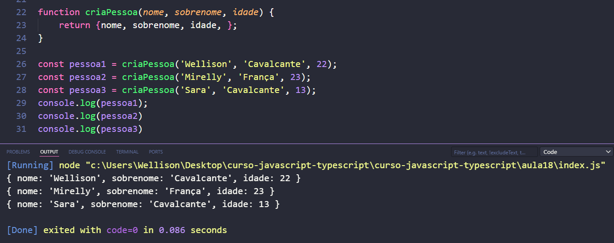
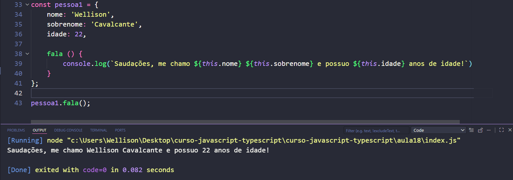

# Objetos (básico)

## 1. Diferença entre const e let.
const *array* = [1, 2, 3];
array.push(4); // [1, 2, 3, 4]
array[0] = 'Wellison'; // [Wellison, 2, 3, 4]

- Não é possível mudar o valor de uma constante
futuramente. 
> Logo, array = 'Wellison', não é possível.

let *array* = [1, 2, 3]
array.push(4); // [1, 2, 3, 4]
array[0] = 'Wellison'; // [Wellison, 2, 3, 4]
array = 'Wellison Cavalcante';
> console.log(array); // Wellison Cavalcante

- let serve para declarar variáveis que podem ter seus valores futuramente alterados.

## Parâmetros x Argumentos

                        - Parâmetros
function criaPessoa(nome, sobrenome, idade) {
}
                            - Argumentos
const pessoa1 = criaPessoa('Wellison', 'Cavalcante', 22)

====================================================

